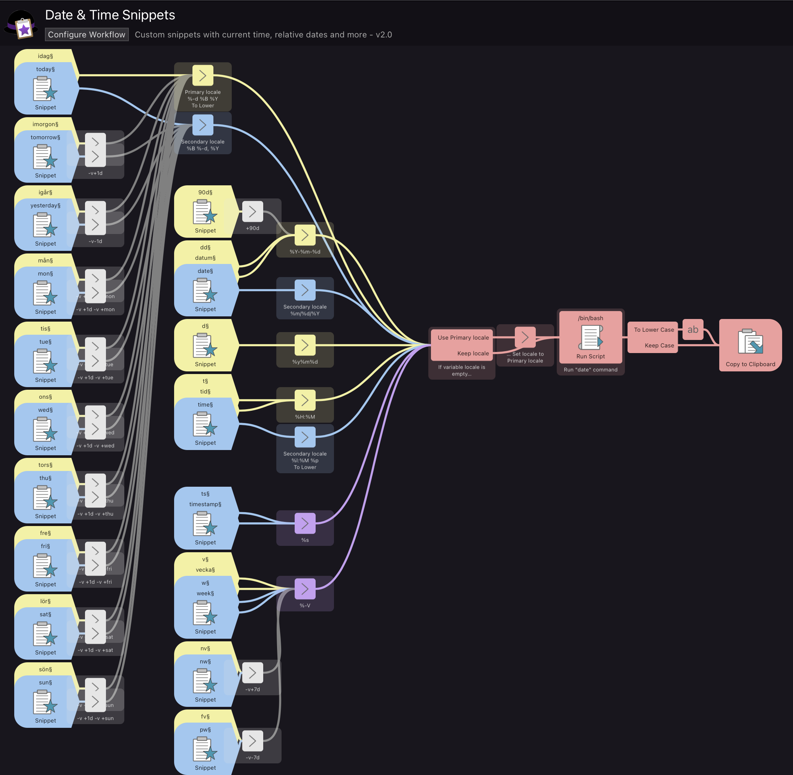

# Date & Time Snippets

[⤓ Download Workflow](https://github.com/psu/alfred-date-time-snippets/raw/master/Date%20%26%20Time%20Snippets.alfredworkflow)

## About

Adds a list of custom snippets with current date, time, relative dates, and more to Alfred.

The workflow supports localization with a Primary locale and a Secondary locale.

## Usage

- Download and install.
- Add your Primary and Secoundary locale in the User configuration.
- Add snippets in your locale to the yellow object.
- For a list of country and locale codes, see for example here: https://saimana.com/list-of-country-locale-code

## How it works

### Unix date command

- Start reading from the purple object executing the `date` command.
- `date` is provided with two arguments: `format` and `params`.
- Before the command is run, a `locale` is set to the environment.
- `format` specifies the output format. For exampel the order between day and month.
- `params` specifies what date to use. If it's not blank, todays date will be used.

### Workflow object colours

- Yellow "Snippets" defines a snippet in the "Primary locale".
- Yellow "Arg and Vars" sets variable `format` aligned to "Primary locale".
- Blue "Snippets" defines a snippet in the "Secondary locale".
- Blue "Arg and Vars" sets variable `format` aligned to "Secondary locale".
- Gray "Arg and Vars" sets variable `params` to define a date (used by all locales).
- Purple "Arg and Vars" sets variable `format` to a format used by all locales.
- Red objects are used to execute the command and output the result.

### Localization

- The Primary locale is intended to be the spcific one.
- My native language is Swedish so the yellow snippets are all in Swedish.
- The Secondary locale is set to American English by default.
- Two locales are implemented by having two snippet objects for each snippet. The benefit of this is that you can have natural language snippets, for the different locales. The drawback is that it is harder to maintain the double amount of objects in the workflow.

## Complete list of Snippets

Different formats show in parentheses.

- Today (Month, DD, YYYY) (MM, DD, YYYY) (MM, DD, YY)
- Now (HH, MM) (Unix timestamp)
- Tomorrow, Yesterday (Month, DD, YYYY)
- Next Monday, Next Tuesday ... Next Sunday (Month, DD, YYYY)
- This week, Next week, Previous week (WW)
- 90 days from now (MM, DD, YYYY)

## Changelog

**v2.0**

- adapt to alfred 5
- add extensive readme

**v1.8**

- add english snippets dates: today, yesterday, etc.
- add a new variables: locale, tolower
- restructure workflow components (reuse set vars)
- add default values for variables
- remove manual clipboard workaround
- add previous week snippet

**v1.7**

- added unix timestamp in seconds, "timestamp" (alias "ts")

**v1.6**

- replace shared suffix with suffix on each trigger, due to interference with other workflows

**v1.5**

- add 2 snippets for time: "time" (alias "t"), "now" (alias "n")

**v1.4**

- add pbpaste and delay to restore clipboard contents

**v1.3**

- add week
- add alias "dd"

**v1.2**

- add 7 snippets for upcoming weekdays

**v1.1**

- add var:params
- add snippet "yesterday"
- add snippet "90d"

**v1.0**

- improve command line to output localized and lower case
- add snippet "today"
- add snippet "date"

**v0.1**

- poc
- add snippet "d"
