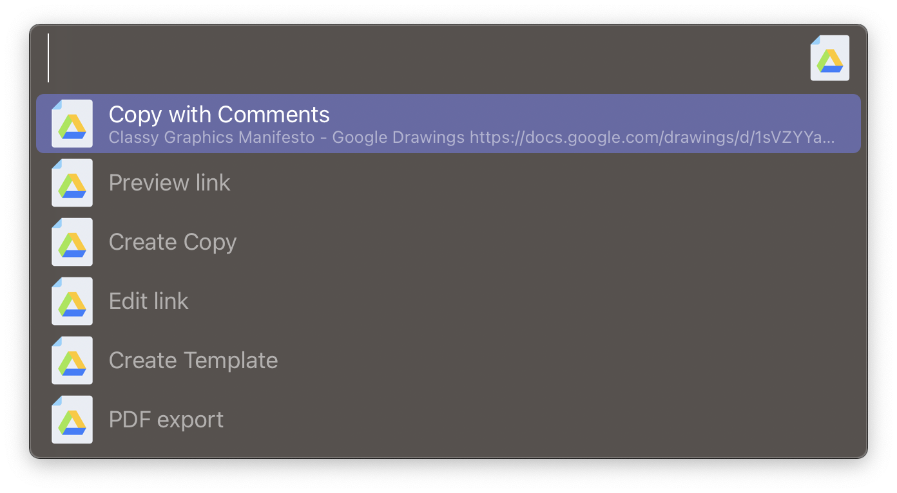

# Share Google Docs

[⤓ Download Workflow](https://github.com/psu/alfred-share-google-docs/raw/v1/Share%20Google%20Docs.alfredworkflow)

## About

The workflow takes a Google Docs URL and modify it to create a share link for any of the following options:

- Preview
- Copy
- Copy with Comments
- Template
- Export PDF
- Edit

## Usage

Trigger the workflow and input the Google Docs URL you want to share.
If the workflow is triggered with a Google Docs in the current tab of your browser, that URL will automatically be used.

## Features

- Get URL from current tab
- Trigger from global shortcut
- Trigger as Universal action
- Fallback on user input
- Copy Share URL to clipboard
- Supported formats:
  - Docs
  - Sheets
  - Slides
  - Drawings

## Changelog

**v1**

- Use external trigger
- Multiple trigger features
- Handle actions with '?' (concatenate query string with '&')
- Different Export PDF action for Presentations and Drawings
- Custom browser

## Attribution

- Share links definitions and inspiration: https://learninginhand.com/blog/google-document-url-tricks
- Icon by Vectorslab from: https://www.flaticon.com/free-icon/google-docs_6711870
